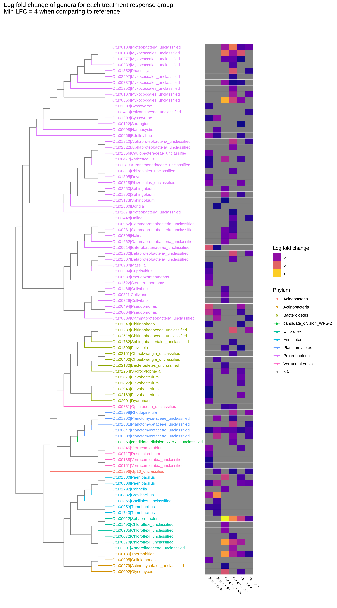
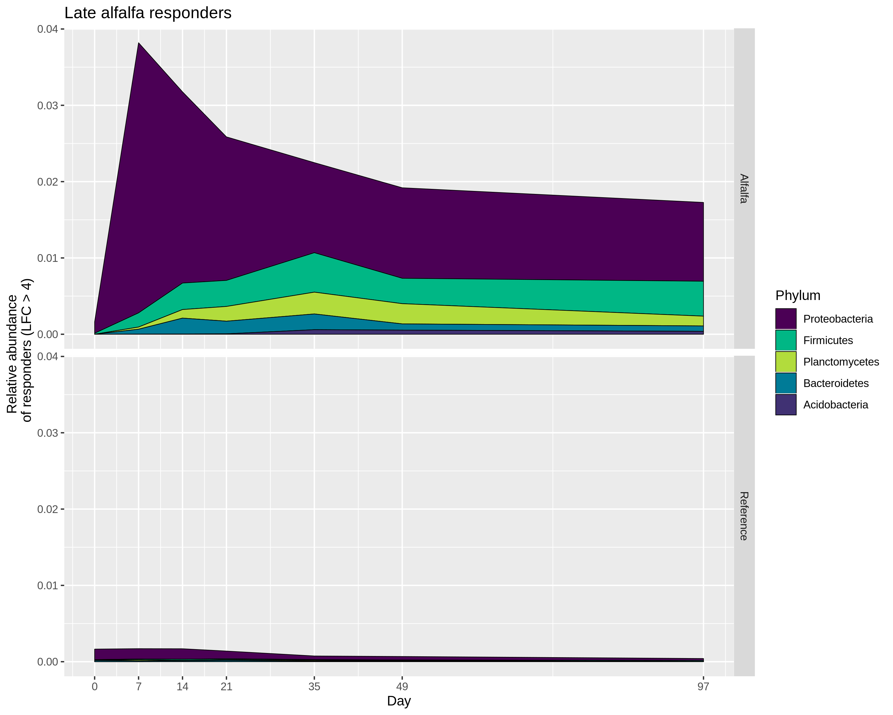
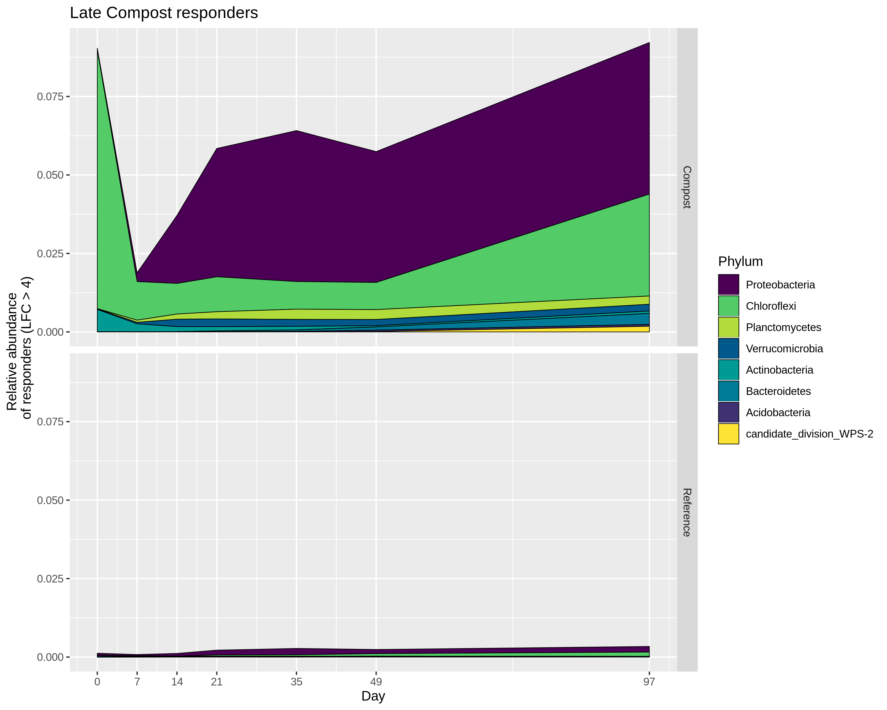

\newpage   
1. Common responding OTU  

+ Why might it be common? EPS from other bacteria?     

+ What does this mean for the ecology of these systems? Some bacteria specialized to "piggy back" of the succsess of others?      
  
2. Relative abundance comparison of OTUs between treatment and reference...normalize these plots?  

3. BLAST some OTUs that are responding and have relative abundance greater than ???  

\newpage
OTU 00847 Planctomycetes *Planctomycetacea (unclassified)* is the only OTU with a LFC > 4 in all treatments and response groups. BLAST analysis of the representative sequence reveals that it is most closely related to THIS. Interestingly, the only other responding (LFC > 4) from this Phylum are detected in the late response groups from each treatment. Togehter, I interpret this to mean that these OTUs are less likely to be responding to the amendment itself and more likely responding to a change that was unique across treatments, perhaps waste processing. The DESeq normalized counts for this OTU reveal that abundances are generally LOW HIGH for this OTU in WHERE WHERE WHERE. 

Responding OTUs following alfalfa amendment and incubation. Early and late response groups determined by hierarchical clustering. Many OTUs are responding compared to reference (Figure 1), but what is the relative abundance of the phyla represented by these OTUs? 
We can see that not all phyla have similar relative abundances despite having 4 log fold changes more OTUs in these phyla compared to reference. What triggered the classification of low abundance responders is the abundance in the reference microcosms. 

On day 7, the relative abundance of responding OTUs was roughly 7% of the total population. The two phyla with the largest response are Proteobacteria and Verrucomicrobia. The other phyla have low relative abundances, perhaps indicating they are less important in the community than the high abundance phyla? 

In the figures below, you will see that despite having OTUs with 4 or greater LFC compared to reference, not all responding phyla have relative abundances that are "significant". In addition, responding phyla rarely make up more than 5% of the community. What does this mean? Many OTUs are stimulated without amendment as are? Perhaps just incubating microcosms caused a significant community shift? 

