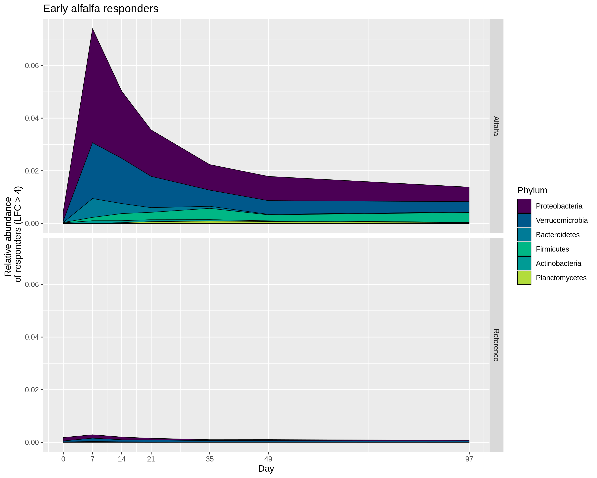
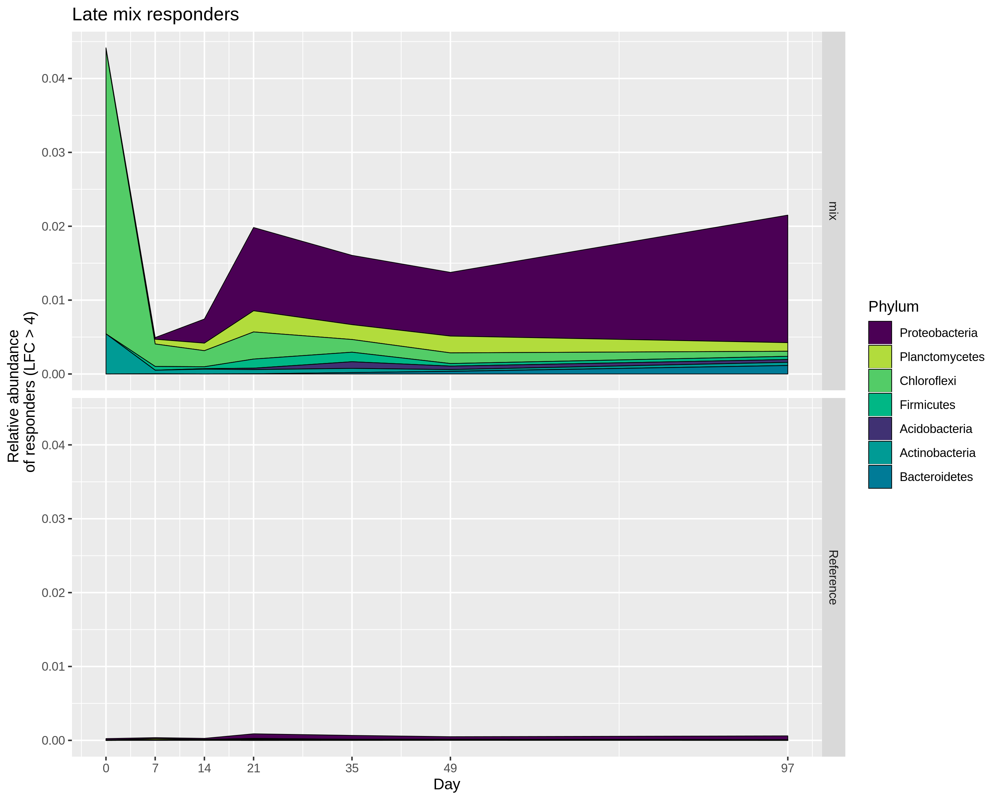

\newpage

Responding OTUs following alfalfa amendment and incubation. Early and late response groups determined by heirarchical clustering. Many OTUs are responding compared to reference (Figure 1), but what is the relative abundance of the phyla represented by these OTUs? 
We can see that not all phyla have similar relative abundances despite having 4 log fold changes more OTUs in these phyla compared to reference. What triggered the classification of low abundance responders is the abundance in the reference microcosms. 

On day 7, the relative abundance of responding OTUs was roughly 7% of the total population. The two phyla with the largest response are Proteobacteria and Verrucomicrobia. The other phyla have low relative abunances, perhaps indicating they are less important in the community than the high abundance phyla? 

In the figures below, you will see that despite having OTUs with 4 or greater LFC compared to reference, not all responding phyla have relative abundances that are "significant". In addition, responding phyla rarely make up more than 5% of the community. What does this mean? Many OTUs are stimulated without amendment as are? Perhaps just incubating microcosms cuased a significant community shift? 

